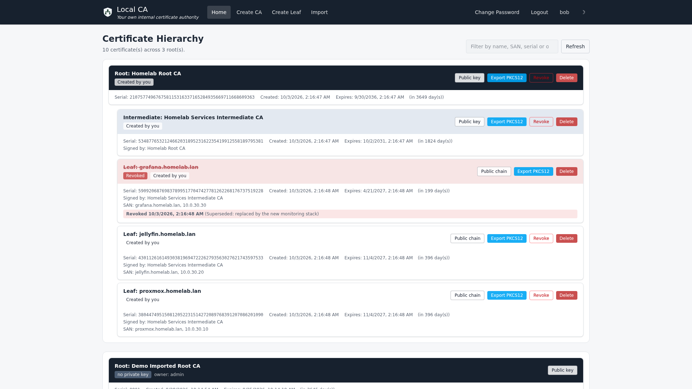
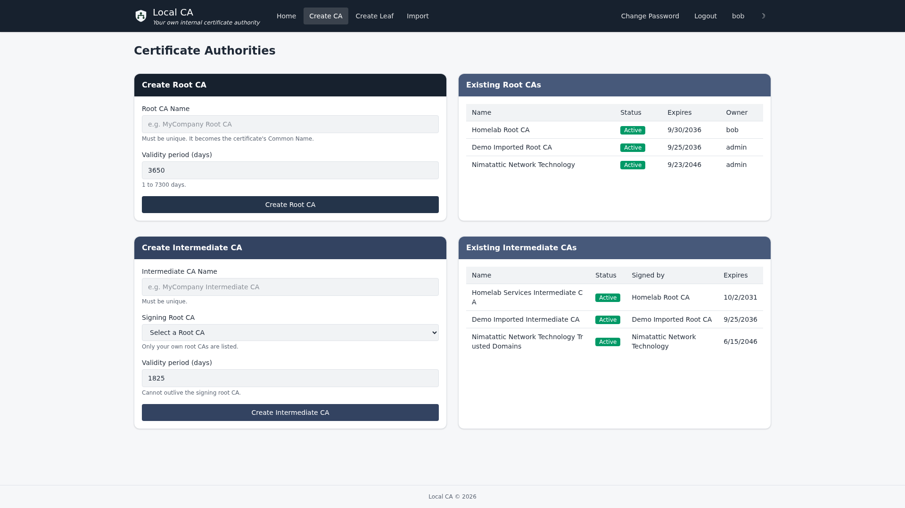
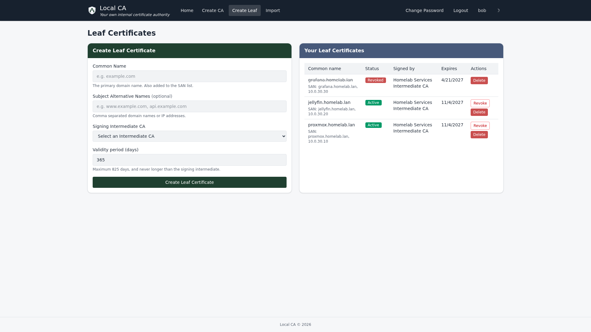
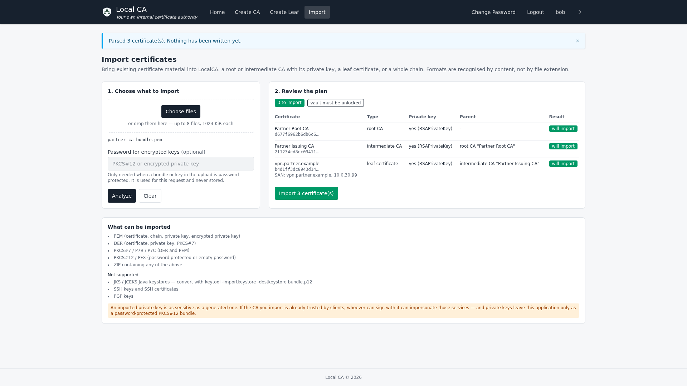
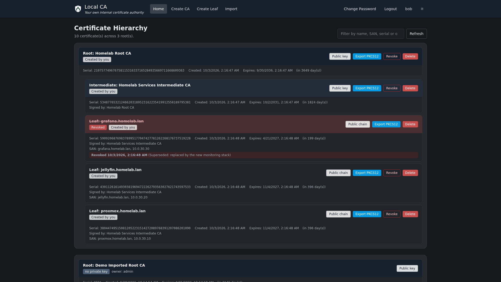

# Local CA
Local CA - Your Own Internal Certificate Authority!

[](https://github.com/tgangte/LocalCA/actions/workflows/pylint.yml)
[](https://github.com/tgangte/LocalCA/actions/workflows/django.yml)

## Welcome to Local CA!

Local CA is an open source self-hosted certificate authority that allows you to run your own [PKI infrastructure](https://en.wikipedia.org/wiki/Public_key_infrastructure) internally or in your homelab/home network.

Say goodbye to those pesky HTTPS INSECURE  warnings when browsing your locally hosted web services!
Local CA serves a Vue 3 single-page web UI from Django: create and download root certificates, intermediate certificates and leaf/end user certificates to secure your services.

With the certificates generated by Local CA, you can add HTTPs to your local instances of Proxmox, Adguard Home, Pi-Hole, Jellyfin, Grafana, Homepage, [Bitwarden](https://bitwarden.com/help/certificates/#use-an-existing-ssl-certificate) etc.



### Features
- Secure your home network with HTTPS without the need for Let's Encrypt (and their complicated setup requirements).
- Create root, intermediate and leaf certificates. The root certificate is self signed, and you need to install it in your browser or client devices as a one time setup.
- Host the Local CA app locally and use the web UI to download certificates.
- Simple and lightweight deployment using docker.
- Personal branding - Name your root certificates whatever you want!
- Use in Mutual TLS (mTLS) applications.

### Screenshots


Create a root CA, and intermediate CAs signed by it


Issue leaf certificates for your services — with SANs — and revoke or delete them from the same page


Import certificates you already have: a CA with its private key, a leaf, or a whole chain — PEM, DER, PKCS#7, PKCS#12 or a ZIP of those


Light and dark themes, following the operating system by default

## Quick Start - Deploy with pre-built docker image from docker hub

Run the following two commands on any directory on your linux terminal to get Local CA up and running quickly.  (Note that you need to have [docker preinstalled](https://docs.docker.com/engine/install/) in your system). Do not expose this web app to the internet, it is for local use only.

```
wget https://raw.githubusercontent.com/tgangte/LocalCA/refs/heads/main/docker-compose-from-registry.yml
docker compose -f docker-compose-from-registry.yml up
```
Note that if you are using a domain name or IP address to access, you need to add that in the CSRF section of docker-compose-from-registry.yml 

Visit the host's IP address or localhost IP [127.0.0.1](http://127.0.0.1/) on your browser. There is **no default password**: on the first start the container creates a superuser named `admin` and prints a randomly generated password once in the log (`docker compose logs web`). Set `DJANGO_SUPERUSER_PASSWORD` before the first start to choose your own. Change it in the UI after signing in.

Alternatively, if you are on ARM architecture such as the Raspberry Pi or Apple Silicon (M1,M2,M3,M4 Mac etc) the you can use the  arm based docker files:
```
wget https://raw.githubusercontent.com/tgangte/LocalCA/refs/heads/main/docker-compose-from-registry-arm.yml
docker compose -f docker-compose-from-registry-arm.yml up

```
This is the docker hub repository https://hub.docker.com/r/practicalsre/local-ca/tags 

The following commands can be used to manage the services:

```
# To start the services in the background, -d runs it in detached (background) mode, so it frees up the terminal.
docker compose -f docker-compose-from-registry.yml  up -d

# To stop the services
docker compose -f docker-compose-from-registry.yml  down
```

### Deploy Behind Reverse Proxy (Traefik, Nginx, etc.)

LocalCA supports deployment behind reverse proxies with custom path prefixes. For example, to deploy at `https://yourdomain.com/localca`:

1. Set the `URL_PREFIX` environment variable: `URL_PREFIX=/localca`
2. Configure your reverse proxy to strip the path prefix before forwarding to LocalCA
3. Add your domain to `CSRF_TRUSTED_ORIGINS`

For detailed instructions on deploying behind Traefik, see [TRAEFIK_DEPLOYMENT.md](TRAEFIK_DEPLOYMENT.md) or use the included `docker-compose-traefik.yml` example configuration.

### Configuration

#### Timezone Configuration

By default, LocalCA uses UTC timezone for all timestamps and certificate expiry dates. You can customize this by setting the `TZ` environment variable in your docker-compose file:

```yaml
environment:
  - TZ=America/New_York  # Set to your desired timezone
```

Common timezone examples:
- `UTC` (default)
- `America/New_York`
- `America/Los_Angeles`
- `Europe/London`
- `Asia/Tokyo`

For a complete list of valid timezone names, see the [IANA Time Zone Database](https://en.wikipedia.org/wiki/List_of_tz_database_time_zones).

### Local build and deploy with docker(only for developers)

```
# Clone this repo
git clone https://github.com/tgangte/LocalCA.git

# cd into  the directory that contains the docker-compose.yml file
cd LocalCA

# Run the docker compose build command, this will build and bring 'up' the app.
sudo docker compose up --build

# Once build is satisfactory, run these to push to docker hub
docker build -t practicalsre/local-ca:latest .
docker push practicalsre/local-ca

# Build steps for nginx for arm image
docker build -t practicalsre/local-ca-nginx:arm-latest -f Dockerfile.nginx .
docker push practicalsre/local-ca-nginx:arm-latest   
```

The compose file reads its settings from `.env`, and the application image runs
unprivileged, so do this once before `docker compose up --build`:

```bash
cp .env.example .env        # fill in DJANGO_SECRET_KEY and DJANGO_ALLOWED_HOSTS
mkdir -p db                 # the database bind mount
printf 'APP_UID=%s\nAPP_GID=%s\n' "$(id -u)" "$(id -g)" >> .env
# ...or leave APP_UID alone and run: sudo chown 10001:10001 db
```

### Security

The web login page and passwords are protected by django-admin and hashed respectively. I recommend creating and deploying HTTPS certs for the LocalCA nginx webserver itself. 
The public and private keys are stored in the unencrypted db.sqlite3 database file, so access to this file must be restricted and the host hardened. 

Since the private keys are not encrypted, I only recommend hosting this internally, not on production or exposed to internet. 

#### Required configuration

Django refuses to start without a secret key. Copy `.env.example` to `.env`
next to the compose file you use and set at least:

```bash
cp .env.example .env
python3 -c "import secrets; print(secrets.token_urlsafe(50))"   # paste into DJANGO_SECRET_KEY
```

- `DJANGO_SECRET_KEY` — required, must stay secret and must not be committed.
- `DJANGO_ALLOWED_HOSTS` — the hostnames/IPs you reach LocalCA under.
- `DJANGO_DEBUG` — leave `false`. With debugging on, any unhandled error renders
  a page that includes the secret key, settings and local variables.
- `DJANGO_SECURE_COOKIES=true` — enable once served over HTTPS; this turns on
  secure cookies, HSTS and an HTTP-to-HTTPS redirect.

#### Private keys are encrypted at rest

Certificate private keys are not stored in cleartext. Each account wraps them with
a **vault password**:

* On your first signing action LocalCA asks you to choose one. It is not the same
  as your login password, though nothing stops you using the same value.
* The vault stays open in the server's memory for 15 minutes of inactivity
  (`LOCALCA_VAULT_IDLE_TIMEOUT` to change it), then locks again. You can also lock
  it explicitly.
* **There is no recovery.** If the vault password is lost, every private key under
  that account becomes permanently unreadable, including CA keys. No administrator
  can reset it. Store it somewhere safe.
* Keys created before this feature, and keys belonging to a certificate with no
  owner, remain cleartext: `python manage.py vault_status` lists exactly which
  keys are encrypted and which are not. Run
  `python manage.py rewrap_keys --username <user>` to encrypt the rest.
* Private keys are exported only as a **password-protected PKCS12 bundle**. There
  is no plaintext private key download, by design.

#### Certificate revocation

Certificates can be revoked from the UI (leaf, intermediate and root). The
revocation is recorded here with an RFC 5280 reason code and an audit entry, so
"revoked" in this app means "recorded and no longer offered for download" — it
is **not** published to clients. LocalCA does not yet serve a CRL or an OCSP
responder, so a certificate that was already installed keeps working until it
expires or you remove it from the trusting system. The confirmation dialog says
this explicitly before you revoke.

#### Deleting certificates

Deleting removes the private key material from the database and cannot be
undone. Deleting a root or intermediate also deletes everything it signed; the
UI warns with the exact count first. Owners may manage their own certificates,
and staff users may manage any certificate.

## Upgrading from an earlier version

If you already run an earlier LocalCA — the upstream layout, where the whole
project sat directly in `/app` — then **replacing the image is not a drop-in
swap**. Your certificates, accounts and audit log are compatible and survive the
upgrade; what changed is the container's contract, in three ways, and each one
misbehaves if you skip it.

### 1. Two environment variables are now required

`DJANGO_SECRET_KEY` is mandatory: LocalCA refuses to start without it. With
`DJANGO_DEBUG=false` (the default) `DJANGO_ALLOWED_HOSTS` is mandatory too. Put
`.env` next to your compose file, generate a key, and list every hostname you
browse LocalCA under:

```bash
cp .env.example .env
python3 -c "import secrets; print(secrets.token_urlsafe(50))"   # into DJANGO_SECRET_KEY
```

### 2. The paths inside the container moved

The image now mirrors the repository layout: the Django project lives in
`/app/localca_project`, and the database and the collected static files moved
with it.

| What | Earlier images | Current image |
| --- | --- | --- |
| SQLite database | `/app/db` | `/app/localca_project/db` |
| Collected static files | `/app/staticfiles` | `/app/localca_project/staticfiles` |

**Update the `web` service's volume targets.** The volume keeps its contents;
only the path it is mounted at changes, so nothing is copied or converted:

```yaml
  web:
    volumes:
      - db:/app/localca_project/db                      # was db:/app/db
      - static_volume:/app/localca_project/staticfiles  # was static_volume:/app/staticfiles
```

nginx keeps `/app/staticfiles`: it mounts the same named volume, and `nginx.conf`
aliases that path. If you skip this step the container still starts — but it
creates a **new, empty database** in its own filesystem layer and serves no
CSS/JS. Your data is not gone, it is simply not mounted.

### 3. The container no longer runs as root

It runs as uid/gid 10001 by default. A database written by an earlier
root-running image is owned by root, and a bind-mounted one is usually owned by
your host account; in either case the new container cannot write it, and startup
fails with `attempt to write a readonly database`. Pick one:

```bash
# a) build the image to run as the volume's owner (best for bind mounts)
docker build --build-arg APP_UID=$(id -u) --build-arg APP_GID=$(id -g) -t localca .

# b) or give the existing volume to the container's user, once
docker volume inspect <project>_db            # find the mountpoint
docker run --rm -v <project>_db:/db alpine chown -R 10001:10001 /db
```

### What happens to your data

Migrations `0002` (revocation targets and comment) and `0003` (vault) apply in
place on the existing database. This is verified end to end: accounts and their
password hashes, roots/intermediates/leaves with their SANs, revocations —
including pre-RFC 5280 free-text reasons — and the audit log all survive, and you
sign in with your existing password.

Private keys created by the earlier version stay in the legacy plaintext column
until you wrap them under a vault password:

```bash
python manage.py vault_status                    # what is encrypted, what is not
python manage.py rewrap_keys --username <user>   # wrap the rest (idempotent)
```

There is no key import in this version — it only issues certificates, it never
ingests them. So exporting every PKCS12 from the old site and importing it into a
fresh one is not an available route; upgrading the database in place is the
supported path.

Before you start, copy `db.sqlite3` (or the named volume) somewhere safe. Rolling
back means restoring that copy: the migrations add columns and tables, and the
older code is not tested against the newer schema.

## Importing certificates

LocalCA can ingest certificate material you already have: a CA with its private
key, a leaf certificate, or a whole chain. The page is **Import** in the top
navigation (`/import`).

Formats are recognised by **content, not by file extension**:

| Accepted | Notes |
| --- | --- |
| PEM | one or many objects per file; certificate and key may be in the same file or in separate files of one submission; `TRUSTED CERTIFICATE` labels are handled |
| Private keys | PKCS#8, PKCS#1, SEC1, and **encrypted** PKCS#8 or traditional OpenSSL (`Proc-Type: 4,ENCRYPTED`) — supply the password |
| DER | certificate, private key, PKCS#7 |
| PKCS#7 / P7B / P7C | DER and PEM. Certificates only, by construction |
| PKCS#12 / PFX | key plus certificate plus additional chain certificates; a single key entry |
| ZIP | a container for any of the above, which is what a bulk migration looks like |

Not supported: **JKS/JCEKS** Java keystores (convert first with
`keytool -importkeystore -destkeystore bundle.p12`), SSH keys and SSH
certificates, and PGP keys — none of those are X.509 material this application
could sign with or export.

### It is a two-step operation

1. **Analyze** uploads the files and returns a plan: every certificate found, the
   type it was recognised as, whether a matching private key came with it, where
   it would sit in the hierarchy, and whether it would be created, skipped or
   refused. **Nothing is written.**
2. **Import** re-uploads the same files to apply that plan.

Nothing is staged on the server between the two steps, so no uploaded key
material outlives a request.

### Two rules the importer follows

* **Private keys go through the vault.** An imported key is wrapped exactly like
  a generated one, so an import that carries a key needs the vault unlocked
  (you are prompted, the same way signing prompts you). There is no path that
  writes an uploaded key to the legacy cleartext column.
* **A certificate without a key is inventory.** It is listed, can be revoked and
  downloaded as PEM, but it cannot sign and cannot be exported as PKCS#12. The
  UI marks it `no private key`, and such a CA is left out of the signing menus
  rather than offered and then refused.

### What ends up where

* A **self-signed CA** becomes a root.
* An **intermediate** must be issued by a root that is in the upload or already
  stored; a **leaf** must be issued by an intermediate. A leaf issued directly by
  a root, or a self-signed end-entity certificate, cannot be represented in the
  root/intermediate/leaf model and is reported as such in the plan instead of
  being forced in.
* The same certificate twice (same SHA-256 fingerprint) is skipped when it is
  already stored. A certificate stored **without** a key, whose key is in the
  upload, gets the key **added**.
* A certificate whose serial number is already used by a *different* certificate
  is refused: serial numbers are unique across the application, so that one needs
  a human decision.
* Imported certificates belong to the account that imported them. A certificate
  may only be attached under a CA that account owns; staff may extend any CA.
* Every import is recorded in the audit log.

### Limits

Up to 8 files, 1 MiB per file, 5 MiB in total and 200 certificates/keys per
submission. ZIP archives are additionally capped by entry count, expanded size
and compression ratio.

### Treat an imported CA with the same care as a generated one

An imported private key is as sensitive as one LocalCA generated. If the CA you
import is already trusted by your clients, then anyone who can sign with it can
impersonate those services — and private keys still leave this application only
as a password-protected PKCS#12 bundle.

## Architecture

LocalCA is split into a JSON API and a single-page frontend:

```
localca_project/          Django: JSON API, ORM, auth, certificate operations
  LocalCA/
    api.py                API endpoints (session/CSRF auth, JSON in/out)
    serializers.py        Certificate -> JSON, including per-user rights
    ca.py                 Certificate generation (cryptography, no openssl shell-out)
    forms.py              Server-side validation for every certificate input
    models.py             Roots, intermediates, leaves, revocations, audit log
frontend/                 Vue 3 SPA (Vite + Tailwind CSS 4)
  src/
    api/                  Typed API client, CSRF handling, downloads
    stores/               Pinia: session, certificates, feedback messages
    views/                One component per page
    components/           Shell, certificate tree, dialogs, form controls
```

Django renders no application pages. It authenticates (session cookie plus CSRF
token), serves the API under `/api/`, and serves the built SPA for every other
path so client-side deep links such as `/create/leaf` work.

### Development steps

Backend:

```bash
git clone https://github.com/tgangte/LocalCA.git
cd LocalCA
python3 -m venv venv
source venv/bin/activate
pip install -r requirements.txt

cd localca_project
export CSRF_TRUSTED_ORIGINS="http://localhost:5173"
export DJANGO_SECRET_KEY=$(python3 -c "import secrets; print(secrets.token_urlsafe(50))")
export DJANGO_DEBUG=true
export DJANGO_ALLOWED_HOSTS=127.0.0.1,localhost

# Migrations are committed, so apply them rather than regenerating.
python manage.py migrate
python manage.py runserver 8000
```

Frontend, in a second terminal. Vite proxies `/api` to Django, so the SPA and
the API share an origin and session/CSRF behave exactly as in production:

```bash
cd frontend
pnpm install
pnpm dev            # http://localhost:5173, proxies /api to :8000
```

To build the bundle that Django serves, run `pnpm build` from `frontend/`: it
writes `frontend/dist`, which `settings.py` picks up automatically. Without a
build, `/` returns a short placeholder page explaining how to make one.

Every asset name carries a content hash, so a rebuilt bundle can never be served
from a stale browser cache. Django does cache the parsed shell template, though:
if `runserver` was started with `--noreload` (as the development setup here does)
restart it after a rebuild, otherwise it keeps serving the previous asset names.

Run the test suite (it does not need a real key):

```bash
DJANGO_TESTING=true python manage.py test LocalCA
```

Build and deploy locally with the above instructions. LocalCA is under active development and contributions are welcome!
